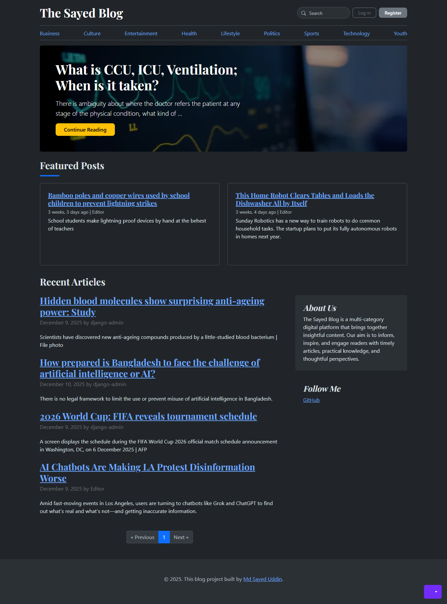
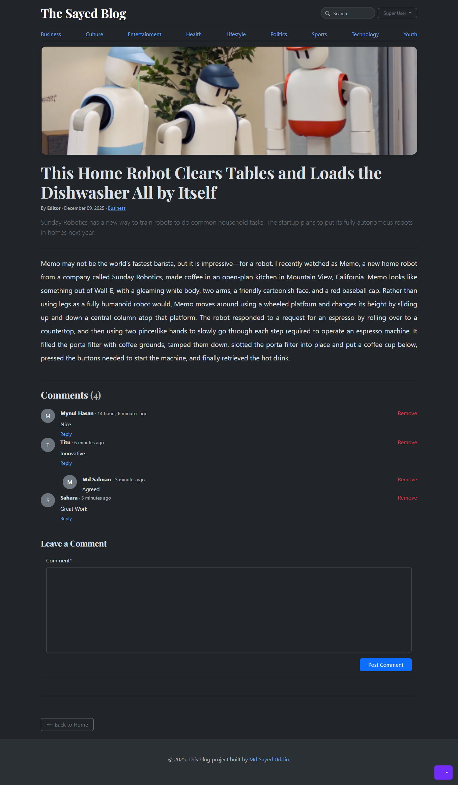
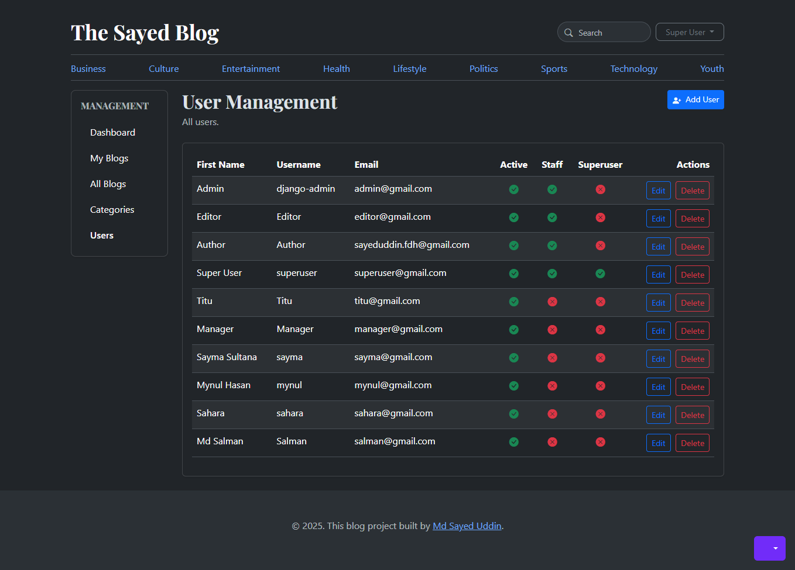
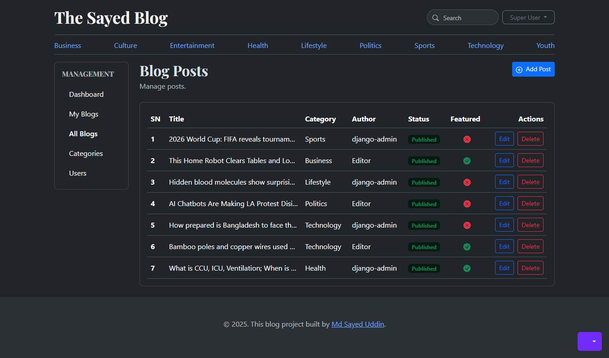

# The Sayed Blog

[](https://www.python.org/)
[](https://www.djangoproject.com/)
[](https://sayed10.pythonanywhere.com/)
[](https://github.com/SayedUddinRayhan/django-blog-platform)


**The Sayed Blog** is a powerful, feature-rich Django blogging platform featuring multi-user roles with role-based dashboards, granular permissions, and secure password reset via SendGrid email integration.


---

## Features

### Core Features
- **User Authentication**: Secure login, registration, and password management.
- **Password Reset via Email**: Users can reset their password securely through **SendGrid email integration**.
- **Role-Based Multi-User System**:
  - **Superuser**:  Full access to all features.
  - **Admin**:  Manage users, posts, comments, and categories.
  - **Manager**:  Manage posts, comments, and categories.
  - **Editor**:  Edit and publish posts.
  - **Author**:  Create and manage their own posts.
  - **Normal User**: Read posts, comment, and reply to comments.
- **Granular Permissions**: Assign user- and group-level permissions; control dashboard access.
- **Blog Management**: Create, edit, and delete posts; categorize content.
- **Comment System**: Moderated commenting with **nested replies**.  
  - Commenters can **edit or delete their own comments**.  
  - Admins can **delete any comment** but **cannot edit comments** of other users.
- **Category Management**: Organize posts efficiently.
- **Responsive Design**: Fully mobile-friendly using **Bootstrap**.
- **Admin Dashboard**: Custom dashboards based on user roles.
- **Search Functionality**: Search posts by title or content.
- **Social Media Integration**: Display follow links.

---

## Screenshots

| Home | Blog Details  | User Management | Blog Management |
|-----------|-----------|-------------|-------------|
|  |  |  |  |


---

## Role vs Dashboard Access

| Role            | Dashboard Access Features |
|-----------------|---------------------------|
| **Superuser**   | Full access to all dashboard features; manage users, posts, comments, categories, and site configuration |
| **Admin**       | Manage users, posts, comments, and categories; can soft-delete any user comment |
| **Manager**     | Manage posts, comments, and categories |
| **Editor**      | Edit and publish posts |
| **Author**      | Create, edit, and manage their own posts |
| **Normal User** | Read posts, comment, and reply to comments |


---

##  Tech Stack

- **Backend**: Python, Django  
- **Frontend**: HTML, CSS, JavaScript, Bootstrap  
- **Database**: SQLite 
- **Email Service**: SendGrid (password reset)  
- **Libraries**: Crispy Forms, Django Guardian

---

##  Installation

1. **Clone the repository**
```bash
git clone https://github.com/SayedUddinRayhan/django-blog-platform.git
cd django-blog-platform
```

2. **Create a virtual environment**
```bash
python -m venv venv
source venv/bin/activate  # Linux/Mac
venv\Scripts\activate     # Windows
```


3. **Install dependencies**
```bash
pip install -r requirements.txt
```

4. **Apply migrations**
```bash
python manage.py makemigrations
python manage.py migrate
```

5. **Create a superuser**
```bash
python manage.py createsuperuser
```

6. **Configure SendGrid**
```python
# Add this to settings.py for SendGrid email integration
EMAIL_BACKEND = "django.core.mail.backends.smtp.EmailBackend"
EMAIL_HOST = "smtp.sendgrid.net"
EMAIL_HOST_USER = "apikey"
EMAIL_HOST_PASSWORD = "YOUR_SENDGRID_API_KEY"
EMAIL_PORT = 587
EMAIL_USE_TLS = True
DEFAULT_FROM_EMAIL = "your_email@example.com"
```

7. **Run the server**
```bash
python manage.py runserver
```


---


**Open http://127.0.0.1:8000/ in your browser to explore the blog.**


---

## Usage

- Register a new user or log in using **superuser/admin credentials**.
- Access dashboards based on your role: Superuser, Admin, Manager, Editor, Author, or Normal User.
- Create and manage posts, comments, and categories from your dashboard.
- Assign permissions to users or groups via the admin panel.
- Reset passwords securely via **SendGrid email integration**.
- Browse, search, and filter blog posts by title or category.
- Interact with posts by commenting and replying to comments.  
  - Users can **edit or delete their own comments**.  
  - Admins can **delete any comment** but **cannot edit others’ comments**.

---

## Contact

- **Author**: Md Sayed Uddin  
- **Email**: sayeduddin.cse@gmail.com  
- **GitHub**: [https://github.com/SayedUddinRayhan](https://github.com/SayedUddinRayhan)

---